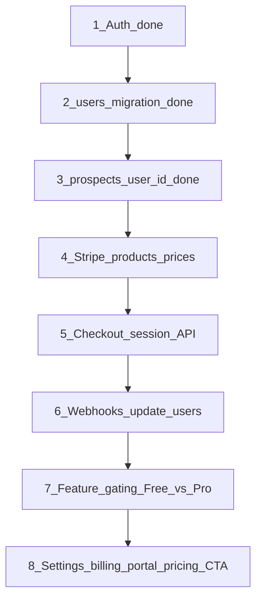

# LeadRadar — Stripe integration guide (adapted)

This document reviews Claude's Stripe guide against the LeadRadar codebase, records what was implemented as **foundation work** (auth + billing schema), and lists the **next steps** for Checkout, webhooks, and feature gating.

Do **not** copy-paste the original guide blindly. The app was previously single-tenant (service role everywhere, no auth). Stripe billing only makes sense after multi-tenant auth and prospect scoping.

---

## Verdict on guide step 1

| Guide proposal | Repo reality | Action taken |
|----------------|--------------|--------------|
| `20240101000000_add_users_table.sql` | Migrations use `0001`…`0008` | **`0009_users_and_billing.sql`** |
| Table `public.users` | Did not exist | Created with RLS + signup trigger |
| RLS SELECT/UPDATE only | Incomplete for client usage | INSERT via `handle_new_user()` trigger; no client INSERT policy (by design) |
| Assumes auth exists | No login/signup before | **Auth added first** (middleware, `/login`, `/signup`) |
| `prospects` global | No `user_id` | **`0010_prospects_user_id.sql`** + RLS |
| Service role everywhere | Bypasses RLS | API routes + app pages migrated to **user-scoped Supabase client** |

---

## Product model: Free vs Pro

**Decision (implemented default):** adopt the guide's two-tier model even though the landing page previously marketed a single Pro plan.

| Plan | Price | Limits (`src/lib/billing/plans.ts`) |
|------|-------|-------------------------------------|
| **Free** | $0 | 5 map searches/mo, 3 audits/mo, 5 AI emails/mo, 1 site mockup/mo |
| **Pro** | $29.99/mo (landing) · $23/mo annual TBD in Stripe | Unlimited |

- New signups start on **`free`** (trigger on `auth.users`).
- Landing pricing CTA now points to **`/signup`** (Free onboarding); Pro checkout comes in a later Stripe step.
- **Harmonize copy later:** landing still shows one Pro card; optional follow-up is a Free + Pro comparison section.

To change limits, edit `PLAN_LIMITS` in `src/lib/billing/plans.ts`.

---

## What was implemented (foundation)

### Database

- `supabase/migrations/0009_users_and_billing.sql` — billing profile + `handle_new_user()` trigger
- `supabase/migrations/0010_prospects_user_id.sql` — `prospects.user_id`, per-user unique `(user_id, google_place_id)`, RLS
- `supabase/schema.sql` — mirror of the above

**Apply migrations:**

```bash
cd leadsite
npm run db:migrate
```

**Legacy prospects** (rows with `user_id IS NULL`) are invisible under RLS. After creating your account, either purge them or assign to your user (one-time, service role):

```sql
update public.prospects
set user_id = '<your-auth-users-uuid>'
where user_id is null;
```

### Auth (before Stripe)

- `@supabase/ssr` browser + server clients
- `src/middleware.ts` — protects app routes; public: `/`, `/login`, `/signup`, `/legal`, `/demo`, `/api/stripe/webhook`
- `src/app/login/page.tsx`, `src/app/signup/page.tsx`, `src/components/auth/auth-form.tsx`
- `src/lib/auth/require-user.ts` — `requireApiUser()`, `requirePageUser()`, `getUserBillingProfile()`
- All prospect API routes and `(app)/*` pages use the **authenticated user client** (RLS enforced)
- `src/app/demo/[id]/route.ts` keeps **service role** (public demo links)
- `src/app/api/email/send/route.ts` — user client for prospect update; service role for `email_logs`

### Env vars

| Variable | Required | Notes |
|----------|----------|-------|
| `NEXT_PUBLIC_SUPABASE_URL` | Yes | Already used |
| `NEXT_PUBLIC_SUPABASE_ANON_KEY` | Yes | Browser + server user client |
| `SUPABASE_SERVICE_ROLE_KEY` | Yes | Webhooks, demo route, email logs |
| `NEXT_PUBLIC_APP_URL` | Recommended | Canonical origin (Stripe redirects, emails). Falls back to `APP_BASE_URL` |
| `STRIPE_SECRET_KEY` | For billing | Server-only; validated via `getStripeEnv()` |
| `STRIPE_WEBHOOK_SECRET` | For billing | Webhook signature verification |
| `NEXT_PUBLIC_STRIPE_PUBLISHABLE_KEY` | For billing | Client Checkout |
| `STRIPE_PRICE_PRO_MONTHLY` | For billing | Price ID from Stripe Dashboard ($29.99/mo) |
| `STRIPE_PRICE_PRO_YEARLY` | For billing | Price ID from Stripe Dashboard (~$23/mo annual) |

Helpers in `src/lib/env.ts`: `getAppUrl()`, `isStripeConfigured()`, `getStripeEnv()`, `getStripePublicEnv()`.  
Price ID lookup: `src/lib/stripe/prices.ts` → `getStripePriceId("monthly" | "yearly")`.

Stripe keys are **optional at boot** — the app runs without them until Checkout/webhooks are wired. Use `isStripeConfigured()` before showing upgrade UI.

Enable **Email/password** auth in the Supabase dashboard.

---

## Verdict on guide step 2 (env vars)

**OK to adopt — with two adaptations:**

| Guide | Repo | Action |
|-------|------|--------|
| `NEXT_PUBLIC_APP_URL` | Project had `APP_BASE_URL` only | **`NEXT_PUBLIC_APP_URL` is canonical**; `APP_BASE_URL` kept as fallback (`getAppUrl()`) |
| Placeholder price IDs | Not in code before | Added to `.env.example` + `getStripeEnv()` |
| All vars required at startup | Would break dev without Stripe | **Lazy validation** — only `getStripeEnv()` throws when billing routes run |

Copy the block from `.env.example` into `.env.local`, then create **Pro Monthly** ($29.99) and **Pro Yearly** ($276/yr or equivalent) products in [Stripe Dashboard → Products](https://dashboard.stripe.com/products) and paste the `price_…` IDs.

**Do not commit** real `sk_`, `whsec_`, or `pk_` keys.

---

## Verdict on guide step 3 (Stripe SDK + Checkout)

**Implemented** with repo-specific adaptations:

| Piece | Location |
|-------|----------|
| `npm install stripe @stripe/stripe-js` | `package.json` |
| Server Stripe client | `src/lib/stripe/server.ts` → `getStripeServer()` |
| Browser loader | `src/lib/stripe/browser.ts` → `getStripeBrowser()` |
| Customer helper | `src/lib/stripe/customer.ts` → `getOrCreateStripeCustomer()` |
| Checkout API | `POST /api/stripe/create-checkout` — body `{ priceId }` (guide path) |
| Legacy alias | `POST /api/stripe/checkout` — body `{ interval: "monthly" \| "yearly" }` |
| Upgrade UI | Settings → `SubscriptionPanel` + `CheckoutButton` |
| RLS hardening | `0011_users_billing_update_rls.sql` — users cannot self-set `plan=pro` |

Checkout uses **hosted Stripe Checkout** (redirect to `session.url`). Plan activation still requires **step 4 webhooks** — success URL shows a pending message until `checkout.session.completed` runs.

Test: log in → Settings → Upgrade → Stripe test card `4242 4242 4242 4242`.

---

## Recommended order (steps 2+)



Steps 1–3, env vars, and **Checkout API** are done. Next: **webhooks** (step 4) to set `plan=pro` in Supabase.

---

## Step 2+ audit checklist (when you paste the rest of the guide)

Use this when reviewing Claude's remaining steps:

### Stripe Checkout

- [x] Install `stripe` package
- [x] Create Stripe products/prices aligned with `STRIPE_PRICING` in `plans.ts` ($29.99/mo; annual optional)
- [x] Add `src/app/api/stripe/create-checkout/route.ts` — `{ priceId }` (guide)
- [x] Add `src/app/api/stripe/checkout/route.ts` — `{ interval }` alias
- [x] Pass `metadata.userId` + `client_reference_id`
- [x] Success/cancel URLs → `/dashboard?upgrade=success` and `/#pricing`
- [x] Wire upgrade UI in `settings/page.tsx` (`SubscriptionPanel`)

### Webhooks

- [ ] Add `src/app/api/stripe/webhook/route.ts` (already public in middleware)
- [ ] Verify signature with `STRIPE_WEBHOOK_SECRET`
- [ ] Handle `checkout.session.completed`, `customer.subscription.updated`, `customer.subscription.deleted`
- [ ] Update `public.users` via **`getSupabaseAdminClient()`** (service role bypasses RLS)
- [ ] Idempotency: store processed event IDs or rely on Stripe retry semantics

### Customer portal

- [ ] `src/app/api/stripe/portal/route.ts` — billing portal for `stripe_customer_id`
- [ ] Link from Settings → Abonnement tab

### Feature gating (Free vs Pro)

- [ ] Helper `assertPlanLimit(userId, feature)` using `getUserBillingProfile()` + `PLAN_LIMITS`
- [ ] Enforce in: `/api/search/*`, `/api/audit`, `/api/prospects/*/pitch-email`, `/api/prospects/*/generate-site`
- [ ] UI: upgrade prompts when limit hit; show plan in sidebar or settings
- [ ] Usage counters: optional `usage_events` table or count rows per month

### Landing & marketing

- [ ] Pricing CTA → `/api/stripe/checkout` for logged-in Pro upgrade, `/signup` for new users (partially done)
- [ ] Align hero copy with Free trial + Pro upgrade story

---

## Do not recreate (already in the project)

- Tables `prospects`, `email_logs` — extend only
- App pages (dashboard, map, audit, email AI, contacted) — add gating, don't rewrite
- Existing API routes — add session + plan checks (auth scoping done)
- Resend email flow — keep; env in `src/lib/env.ts` unchanged for Stripe phase

---

## Pricing inconsistencies to fix in Stripe Dashboard

| Source | Value |
|--------|-------|
| Landing | $29.99/mo |
| Original guide | $29/mo or $23/mo annual |

Use **$29.99/mo** in Stripe to match the landing unless you change marketing copy.

---

## Manual test plan (after `db:migrate`)

1. Sign up at `/signup` → row in `public.users` with `plan = 'free'`
2. Map search → prospects saved with your `user_id`
3. Audit / pitch email / contacted flow → only your prospects visible
4. Log out → `/dashboard` redirects to `/login`
5. Public `/demo/:id` still renders (service role)

---

## Next action for you

1. Run `npm run db:migrate` (includes `0011_users_billing_update_rls.sql`).
2. Paste **step 4** (webhook handler) when ready.
